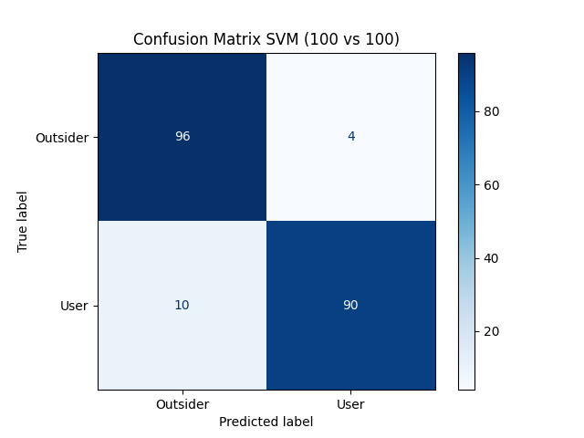
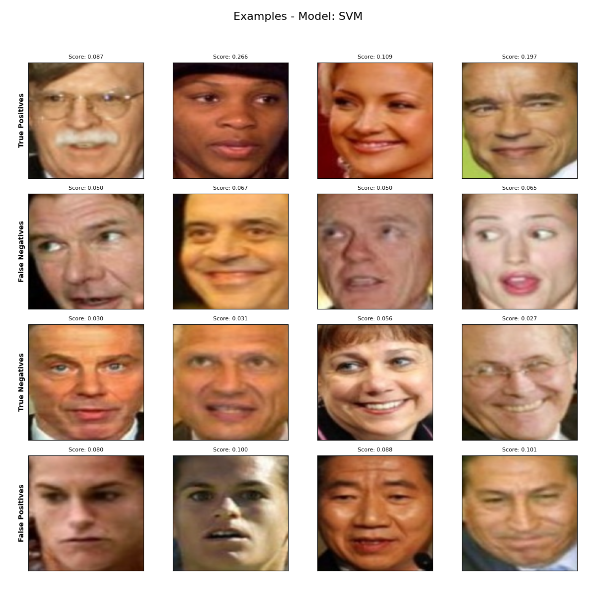
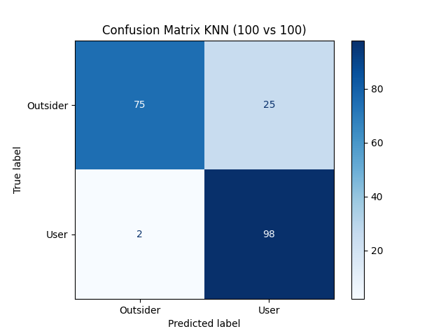
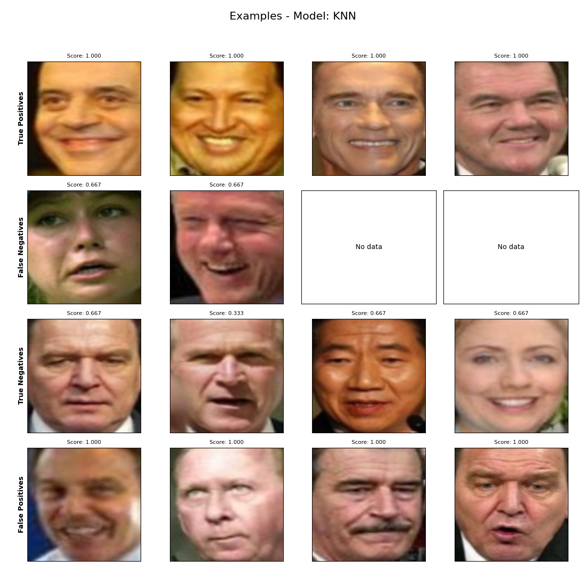
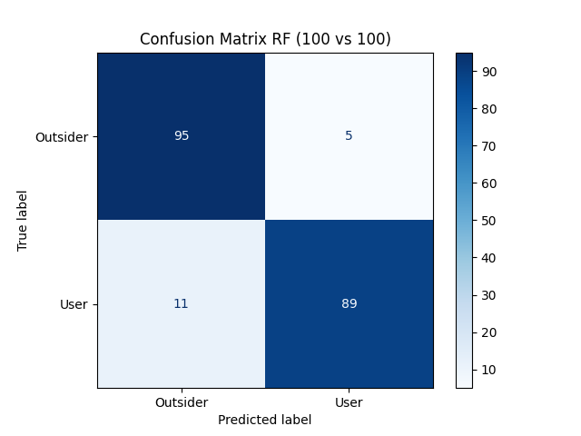
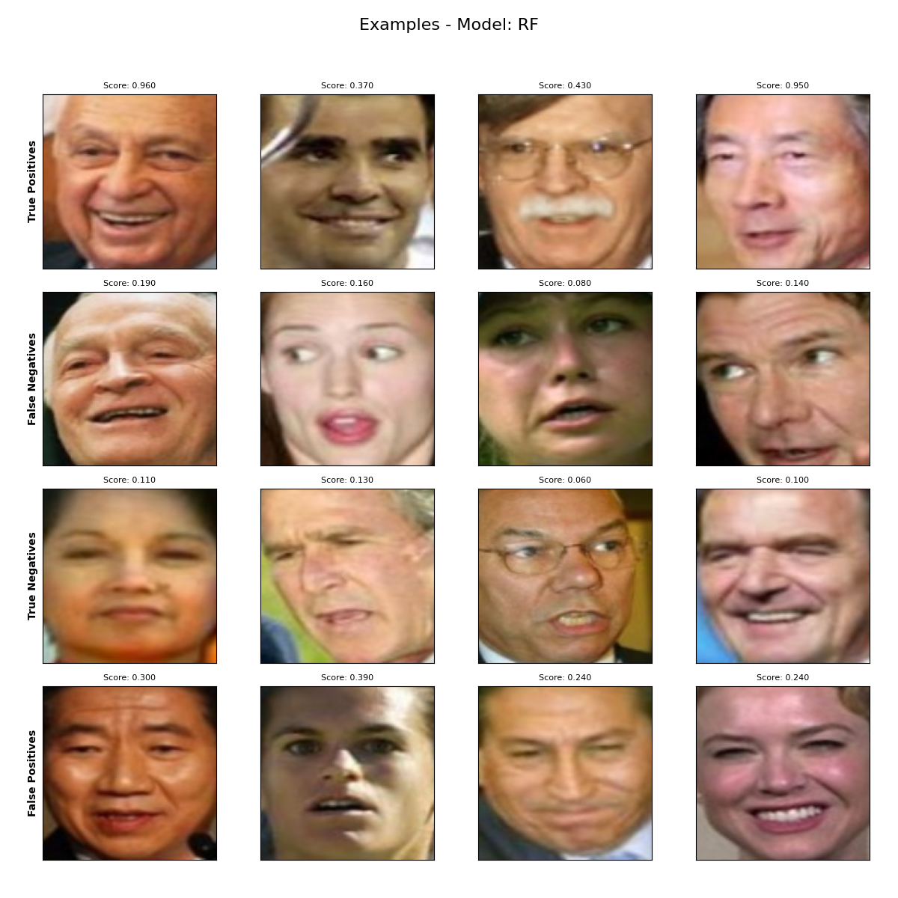

# Face Recognition Biometric Evaluation System

This repository provides a complete pipeline for evaluating biometric face recognition systems using FaceNet (InceptionResnetV1) for feature extraction and various machine learning classifiers for identification and verification tasks.

### Features
* Automated Data Pipeline: Splits the LFW dataset into known users and unknown users to simulate real-world biometric scenarios.
* Deep Feature Extraction: Uses pre-trained FaceNet models (VGGFace2) to generate 512-dimensional embeddings.
* Biometric Performance Analysis: Calculates metrics such as EER and accuracy, generates confusion matrices.

## Description of Files

### `dataset.py`
Handles the fetching of the Labeled Faces in the Wild (LFW) dataset. It normalizes images to the specific range required by FaceNet ([-1, 1]) and splits the data into training, testing (closed-set), and outsider (open-set/impostor) groups.

### `f_extraction.py`
The core extraction script. It loads the pre-trained `InceptionResnetV1` model and processes the image tensors in batches. It outputs NumPy files (`.npy`) containing the 512D embeddings and corresponding labels into a `features/` directory.

### `train_and_eval.py`
The evaluation engine. It trains selected classifiers (SVM, KNN, or Random Forest) on the extracted features and calculates both standard classification accuracy and specialized biometric verification performance. Generates confusion matrices and grids showing faces for each category (TP, FN, TN, FP).


### Example Run

First, generate the feature embeddings (e.g., for 100 users and outsiders each):
```bash
python f_extraction.py --users 100 --batch_size 64
```

Then, run the evaluation:
```bash
python train_and_eval.py
```

## Dependencies and Installation

This project requires Python 3.10+ and the following libraries:

- `torch==2.1.0` — PyTorch deep learning framework for model inference.
- `torchvision==0.16.0` — Image processing utilities for PyTorch.
- `facenet-pytorch==2.5.3` — Pre-trained FaceNet implementations.
- `scikit-learn==1.3.1` — Machine learning classifiers and evaluation metrics.
- `opencv-python==4.8.1.78` — Image resizing and preprocessing.
- `numpy==1.24.3` — Numerical computation and data storage.
- `matplotlib==3.8.0` — Visualization of results.

### Installing via `requirements.txt`

Create and activate a virtual environment (optional but recommended):
```bash
python -m venv venv
source venv/bin/activate  # Linux/macOS
# or
venv\Scripts\activate     # Windows

pip install -r requirements.txt
```

## Installation via Conda

Create a Conda environment from an `environment.yaml` file (if provided) or manually:
```bash
conda create -n face_biometrics python=3.10
conda activate face_biometrics
pip install -r requirements.txt
```

## Results

The training and evaluation results provide a comprehensive biometric report:
- Accuracy (ID): Recognition rate for known users in a closed-set scenario.
- EER (Equal Error Rate): The threshold where the rate of false acceptances (FAR) equals the rate of false rejections (FRR).

### Summary Statistics

| Model | EER | Threshold | TP (Access) | TN (Rejection) | FP (Error) | FN (Error) |
| :--- | :---: | :---: | :---: | :---: | :---: | :---: |
| **SVM** | 0.0700 | 0.080 | 90 | 96 | 4 | 10 |
| **KNN** | 0.1350 | 0.667 | 98 | 75 | 25 | 2 |
| **RF** | 0.0800 | 0.239 | 89 | 95 | 5 | 11 |

### Model Analysis

#### 1. Support Vector Machine (SVM)
The model is characterized by high precision in rejecting unauthorized individuals.
* **Confusion Matrix:**

<div align="center">
    
</div>

* **Classification Visualization:**


#### 2. K-Nearest Neighbors (KNN)
At the EER threshold, the KNN model showed very high sensitivity (few FN errors), but at the cost of a higher number of false acceptances (FP).
* **Confusion Matrix:**

<div align="center">
    
</div>

* **Classification Visualization:**


#### 3. Random Forest (RF)
Achieved the best EER score (0.0700), offering the most balanced compromise between security and user convenience.
* **Confusion Matrix:**

<div align="center">
    
</div>

* **Classification Visualization:**


## Installation and Execution

1. Install requirements: `pip install -r requirements.txt`
2. Generate features: `python f_extraction.py --users 100`
3. Run evaluation: `python train_and_eval.py`

